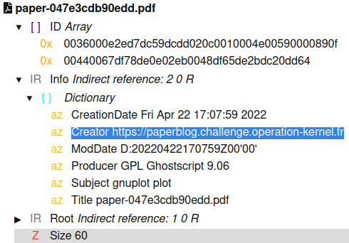

# Forensics / Research paper

## Challenge (100 points)
Un scientifique a publié un article sur une technologie nucléaire de pointe qui pourrait révolutionner le domaine de l’énergie

Ces recherches, très novatrices, vont surement être convoitées par des personnes malveillantes et nous devons le retrouver pour le protéger.

L'article est disponible au format pdf. Il n'a laissé ni nom, ni aucune autre information dans son article qui permettent de l'identifier, cependant il existe probablement un moyen à partir du document de récupérer plus de données pour le retrouver.
Bien commencer

Dans un fichier, il y a ce que l'on voit (son contenu) mais aussi les données que l'on ne voit pas.

## Inputs
- PDF file: [paper-047e3cdb90edd.pdf](./paper-047e3cdb90edd.pdf)

## Solution
Inspecting the PDF structure using https://pdfux.com/inspect-pdf/ for instance shows this structure and reveals the contents of field `Creator`:

Then going to `https://paperblog.challenge.operation-kernel.fr/` shows the research articles from `Lise MITENER`:

## Flag
HACK{Lise.MITENER}