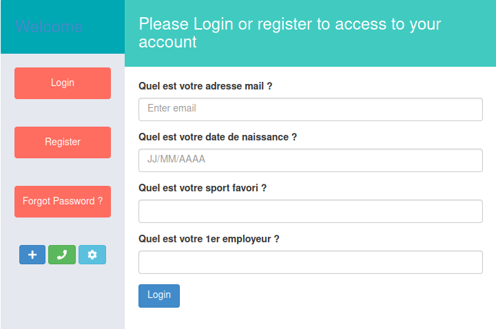
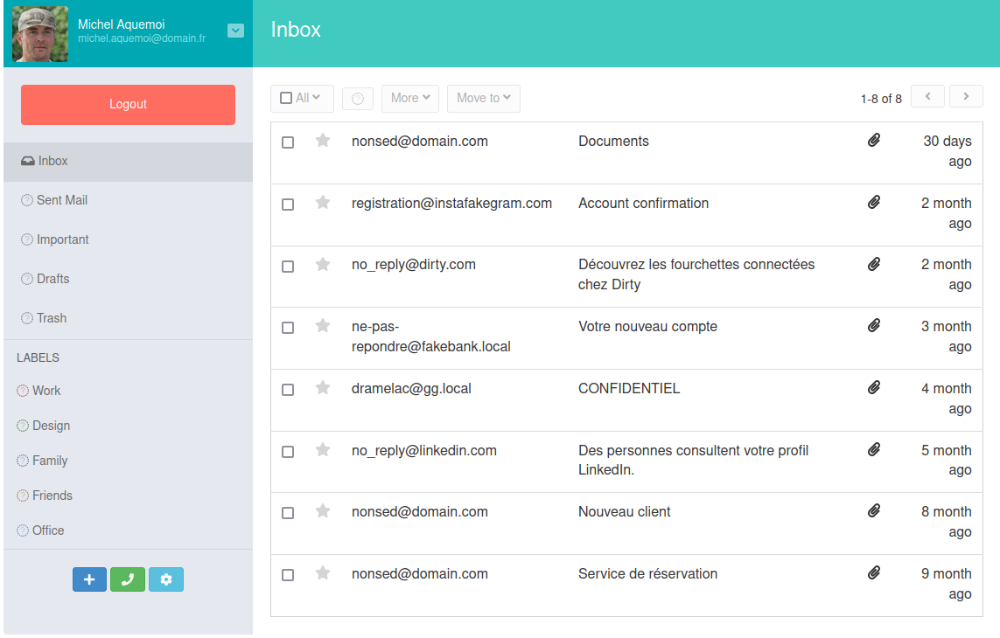

# OSINT / Pour vivre secure vivons caché

## Challenge (100 points)
Dans le fichier excel récupéré précedemment, nous avons identifié une autre personne.
Nos équipes ont retrouvé un blog lui appartenant.
Il serait probablement intéressant d'examiner ce dernier à la recherche d'informations concernant cette personne.

Bien commencer: Noter le maximum d'informations sur la personne pour ensuite les utiliser afin de récupérer son compte mail. 

## Inputs
- Blog: `blog.challenge.operation-kernel.fr`

## Solution
We navigate through the blog (pretty much empty). The `contact` section sends us to the (fake) `Facebook` account for `Michel Aquemoi` revealing some information:
- Born 26th september 1988 in Saint-Etienne
- (fake) `LinkedIn` profile: michel-aquemoi-19082216b at `https://linkedfakein.challenge.operation-kernel.fr/`
- (fake) `Instagram` profile: Shopeors at `https://instafakegram.challenge.operation-kernel.fr/`

The fake `Instagram` profile reveals some photos of `Boxing`, which could be its favorite sport.

The fake `LinkedIn` profile reveals its email address `michel.aquemoi@challenge.operation-kernel.fr`, his experience at `Séphori` and a weird mail server `https://mail.challenge.operation-kernel.fr/forget.php`

We know his email address, but not the associated password, so we can't login into that email server. But there is a `Forgot Password` page, where we're asked for some secret phrases... that are not so secret, because we've already collected them all !

With the collected information, we can login to his email account:

Going through his emails we find out the flag in one of them:
> De : dramelac@gg.local Le : 2022-02-07 17:47:33 A: michel.aquemoi@challenge.operation-kernel.fr
> Bonjour Michel,
> 
> Merci d'avoir réservé un coffre chez nous.
> Voici votre mot de passe unique pour pouvoir y accéder : HACK{SE_Inf0_Ar3_3veRyWH3R3}
> 
> Bon voyage.

## Flag
HACK{SE_Inf0_Ar3_3veRyWH3R3}
