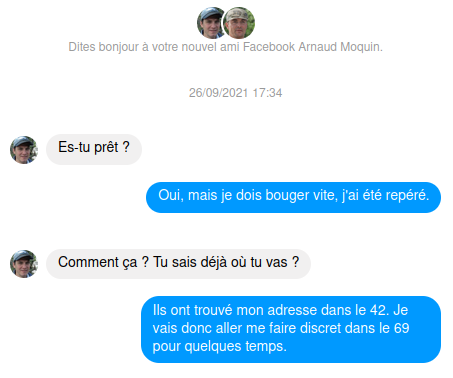

# OSINT / Pour vivre secure vivons caché Part 2

## Challenge (200 points)
Nous avons réussi via la procédure de récupération de compte mail à accéder à sa messagerie.
Examinons tous ses messages à la recherche d'informations sensibles.

Bien commencer: Trouvez un moyen de s'authentifier sur les autres comptes de la cible afin de collecter encore plus d'informations.

## Inputs
- Blog: `blog.challenge.operation-kernel.fr`

## Solution
Let's go through `Michel Aquemoi` emails on `https://mail.challenge.operation-kernel.fr/mail.php`

# Instagram credentials
> De : registration@instafakegram.com Le : 2022-04-15 03:09:10 A: michel.aquemoi@challenge.operation-kernel.fr
> Bonjour Michel,
>    
> Bienvenue sur Instafakegram !
>
> Voici un récapitulatif de votre compte:
> Adresse mail : michel.aquemoi@challenge.operation-kernel.fr 
> Mot de passe : MichelInstafakegram42!

Logging into his (fake) `Instagram` profile doesn't give us anything new. But we know the password is valid, and so we may have a template for his other passwords, maybe.

# Bank account ID at https://fakebank.challenge.operation-kernel.fr/
> De : ne-pas-repondre@fakebank.local Le : 2022-03-16 02:42:38 A: michel.aquemoi@challenge.operation-kernel.fr
> Bonjour Michel,
> 
> Voici les informations de connexion à votre compte :
> identifiant : 3735928559
> mot de passe : hi67kf
> 
> Ce mot de passe est autogénéré et sera à modifer à la première connexion
> Vous pouvez dès à présent accéder à votre compte en cliquant [ici](https://fakebank.challenge.operation-kernel.fr/).
> 
> Merci d'avoir choisi notre banque

These credentials don't work: the autogenerated password is not valid anymore. Maybe his new password is crafted in a similar way as his `Instagram` password. So let's try these:
- MichelBankfake42!
- Michelbankfake42!
- MichelFakebank42!
- Michelfakebank42!

Unfortunately, none of these is granted, so there's nothing else we can do, I think. Move on.

# A conversation with nonsed@domain.com about a reservation service and a client:
> De : nonsed@domain.com Le : 2022-05-29 22:41:23 A: michel.aquemoi@challenge.operation-kernel.fr
> C'est bon, on a mis la main sur les documents ! Ils sont encore dans le dossier upload du serveur. 
> Préviens le client que tout ce passe bien et qu'on va pouvoir venir l'escorter comme prévue dans deux semaines.

> De : nonsed@domain.com Le : 2021-10-08 21:38:42 A: michel.aquemoi@challenge.operation-kernel.fr
> Hello Shopeors,
> On a un nouveau client, ils nous a contacte via https://ia.challenge.operation-kernel.fr
> Envoie lui le lien vers notre service de reservation.

An attachement `contract.zip` related to a reservation service:
> De : nonsed@domain.com Le : 2021-09-04 12:25:45 A: michel.aquemoi@challenge.operation-kernel.fr
> Hello Shopeors,
> On a enfin fini le service de réservation, je te laisse le déployer.
> contract.zip

We find an `ELF binary` in the attached `contrat.zip`
```shell
$ unzip contract.zip
Archive:  contract.zip
  inflating: contract

$ file contract
contract: ELF 32-bit LSB pie executable, Intel 80386, version 1 (SYSV), dynamically linked, interpreter /lib/ld-linux.so.2, for GNU/Linux 3.2.0, BuildID[sha1]=16dc571ea7d2fa0db3f823ae89a199e3d8d10c1a, not stripped
```

Running `strings` shows what looks like credentials: (Administrathor, gH5pFtpm):
```shell
$ strings contract
(...)
Login:
Password:
Administrathor
gH5pFtpm
(...)
```

But that's probably needed for another challenge. Move on.

# Facebook account at https://fakebook.challenge.operation-kernel.fr/
Let's try to login in his (fake) `Facebook` account with a password similar to the one for his (fake) `Instagram` account: `MichelInstafakegram42!`.

And we can indeed looging with creds (michel.aquemoi@challenge.operation-kernel.fr, `MichelFakebook42!`) ! Nothing special except one discussion with another guy `Arnaud Moquin` in the instant messages, where the talk about moving from the `42` to the `69`. Could be the departement... or some password as well!



# Bank account at https://fakebank.challenge.operation-kernel.fr/
We have his ID: 3735928559. Let's try a password still similar to the `Instagram` & `Facebook` ones, but with 69 instead of 42.

We can indeed login with creds (3735928559, `MichelFakebank69!`) and get the flag !

## Flag
HACK{M0r3_InF0_Y0u_H4v3_M0re_Y0u_C4n_G3T}
