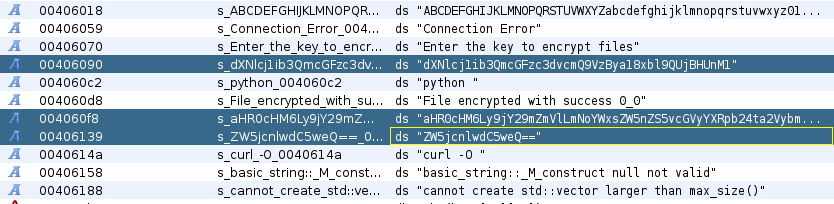
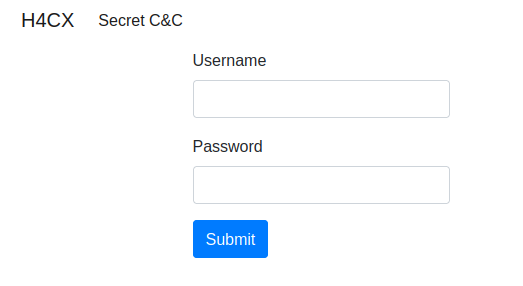
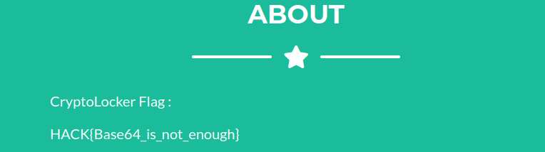

# Reverse / CryptoLocker

## Challenge (100 points)
Les preneurs d'otages ne sont que des mercenaires payés pour faire le sale travail. Aucun d'entre eux n'a suffisamment d'information pour identifier les commanditaires.

Une fois la situation revenue sous contrôle, Lise MITENER a récupéré son ordinateur personnel. Malheureusement, cette dernière nous indique que ces fichiers sont devenus illisibles.

Visiblement, la totalité de ses documents a été chiffrée. Nos équipes ont pu retrouver l'exécutable à l'origine de cette modification, voyez s'il est possible d'en extraire des informations nous permettant de remonter la trace des commanditaires.
Bien commencer

Il est fort probable que les preneurs d'otage n’ont pas été payés uniquement pour chiffrer les fichiers de madame MITENER. Les commanditaires sont surement intéressés par ses recherches, ainsi, les documents ont probablement été téléversés sur un serveur distant.

## Inputs
- Binary: [cryptolocker](./cryptolocker)

## Solution
The binary is an ELF file, not stripped:
```shell
$ file cryptolocker
cryptolocker: ELF 64-bit LSB executable, x86-64, version 1 (SYSV), dynamically linked, interpreter /lib64/ld-linux-x86-64.so.2, for GNU/Linux 3.2.0, not stripped
```

Loading it into `GHIDRA` we search for strings and find some `base64` encoded strings:



After `base64` decoding them, we found a `C2 server` associated with some `credentials`, as well as the name of a Python script:
```shell
$ echo -n dXNlcj1ib3QmcGFzc3dvcmQ9VzBya18xbl9QUjBHUnM1 | base64 -d
user=bot&password=W0rk_1n_PR0GRs5

$ echo -n aHR0cHM6Ly9jY29mZmVlLmNoYWxsZW5nZS5vcGVyYXRpb24ta2VybmVsLmZyL2My | base64 -d
https://ccoffee.challenge.operation-kernel.fr/c2

$ echo -n ZW5jcnlwdC5weQ== | base64 -d
encrypt.py
``` 

Let's have a look to the `C2 server` at https://ccoffee.challenge.operation-kernel.fr/c2:




Let's try to login with the credentials with found `(bot, 'W0rk_1n_PR0GRs5')`.. and we're in ! We can find the flag somewhere in the C2 page:



## Flag
HACK{Base64_is_not_enough}
