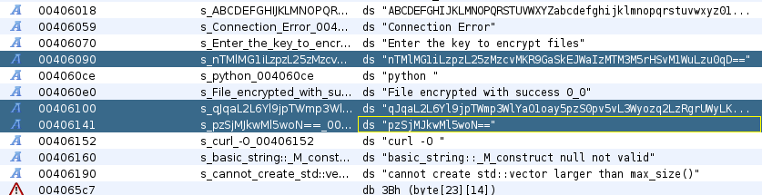
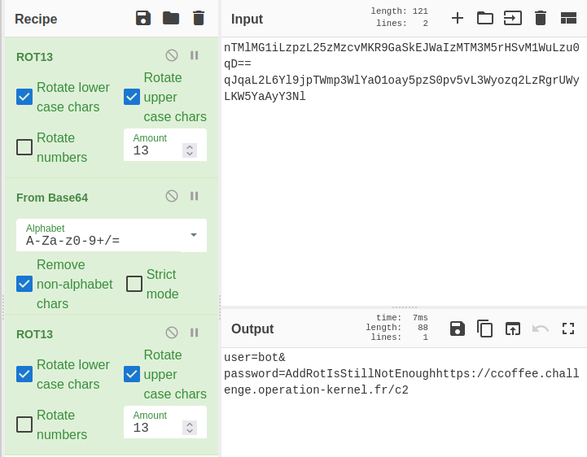

# Reverse / What_if_CryptoLocker

## Challenge (200 points)
Qu'est-ce qui se passerait si c'était plus complexe ?

Il est nécessaire de continuellement monter en compétence afin de pouvoir faire face aux menaces futures. Nos équipes ont donc recréé le scénario d'attaques en relevant le niveau technique.

Bien commencer:
L'objectif reste le même : retrouver l'URL, le nom d'utilisateur et le mot de passe utilisé par le cryptolocker.

## Inputs
- Binary: [crypto](./crypto)

## Solution
The binary is again an `ELF` file, still not stripped:
```shell
$ file crypto
crypto: ELF 64-bit LSB executable, x86-64, version 1 (SYSV), dynamically linked, interpreter /lib64/ld-linux-x86-64.so.2, for GNU/Linux 3.2.0, not stripped
```

Loading it into `GHIDRA` we search for strings and find some `base64` encoded strings:



Looking at how those `base64 strings` are decoded in function `getData()`, we see that they pass through `ROT13`, then `BASE64`, then `ROT13` again:
```c++
void getData(basic_string *param_1)
{
  basic_string local_28 [32];
  
  rot(param_1,0xd);
  base64_decode(local_28);
  std::__cxx11::basic_string<char,std::char_traits<char>,std::allocator<char>>::~basic_string
            ((basic_string<char,std::char_traits<char>,std::allocator<char>> *)local_28);
  rot(param_1,0xd);
  return;
}
```

Let's bake our recipe in `CyberChef` (ROT13, BASE64, ROT13):



So we get new credentials `(bot, 'AddRotIsStillNotEnough')`, and since flag format is HACK{User_Password}, we have our flag!

## Flag
HACK{bot_AddRotIsStillNotEnough}
